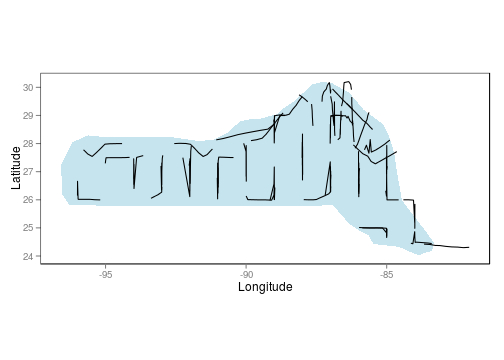
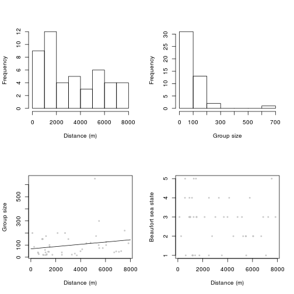
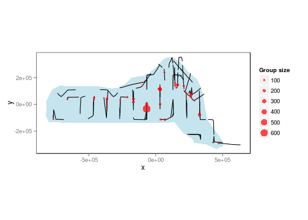
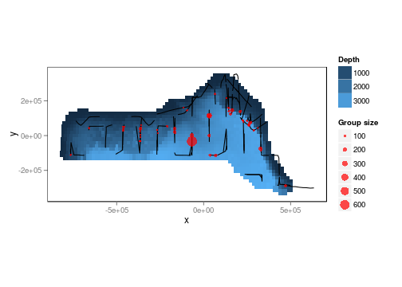
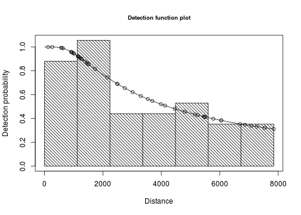
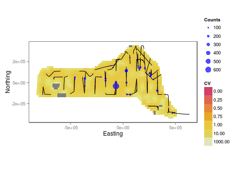
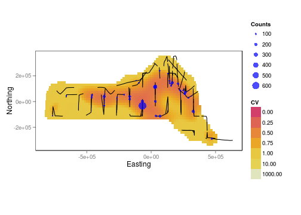
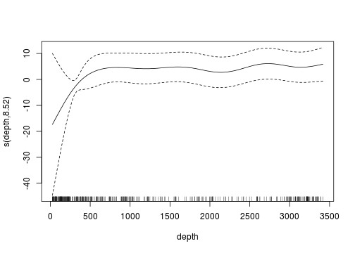

# Overview of new features in dsm

## Preamble

This is a `knitr` document. The source for it contains everything you need to reproduce the analysis given here (aside from the data). The most recent version of this document can always be found at [github.com/dill/mexico-data](http://github.com/dill/mexico-data) (along with the data).

The data set consists of observations of dolphins in the Gulf of Mexico. The analysis is based on a dataset which is shipped with Distance 6.0. For convenience the data are bundled in an `R` friendly format, although all of the code necessary for creating the data from the Distance project files is available at the above URL.

The intention here is to highlight the features of the `dsm` package, rather than perform a full analysis of the data. For that reason, some important steps (such as model checking) are not fully explored.

Familiarity with density surface modelling is assumed (see, e.g. Hedley and Buckland, 2004).

Before we start, we load some `R` libraries and set some options: 

```r
library(ggplot2)
library(vcd)
```

```
## Loading required package: MASS
```

```
## Loading required package: grid
```

```
## Loading required package: colorspace
```

```r
gg.opts <- opts(panel.grid.major = theme_blank(), panel.grid.minor = theme_blank(), 
    panel.background = theme_rect())
# maps
library(maps)
# make the results reproducable
set.seed(11123)
```


## Getting the data into `R`

### Survey area

The `R` package `maptools` can be used to load the survey region shape file.

```r
library(maptools)
```

```
## Loading required package: foreign
```

```
## Loading required package: sp
```

```
## Loading required package: lattice
```

```
## Checking rgeos availability: FALSE Note: when rgeos is not available,
## polygon geometry computations in maptools depend on gpclib, which has a
## restricted licence. It is disabled by default; to enable gpclib, type
## gpclibPermit()
```

```r
survey.area <- readShapeSpatial("data/Study_ar")
survey.area <- data.frame(survey.area@polygons[[1]]@Polygons[[1]]@coords)
names(survey.area) <- c("longitude", "latitude")
```


Note that we ignore the file type extension in the call to `readShapeSpatial` and then we discard most of the information in the returned object, since we just require the latitude and longitude of the points which bound the survey region.

### Observation and segment data

All of the data for this analysis has been nicely pre-formatted and can be found in `data/dolphins.RData`. Loading up that data, we can see that it contains four data frames, the first few lines of each are shown:

```r
load("data/dolphins.RData")
head(segdata)
```

```
##   latitude longitude Effort Transect.Label Sample.Label depth      x
## 1    29.94    -86.93  13800       19960417   19960417-1 135.0 134159
## 2    29.84    -86.83  14000       19960417   19960417-2 147.7 143496
## 3    29.75    -86.74  14000       19960417   19960417-3 152.1 152050
## 4    29.66    -86.65  13900       19960417   19960417-4 163.8 161102
## 5    29.56    -86.57  13800       19960417   19960417-5 179.7 169553
## 6    29.49    -86.49  13800       19960417   19960417-6 188.5 176793
##        y
## 1 325561
## 2 314055
## 3 304324
## 4 293475
## 5 282984
## 6 275103
```

```r
head(distdata)
```

```
##     object size distance Effort detected beaufort latitude longitude
## 45      45   21   3296.6  36300        1        4    27.73    -86.00
## 61      61  150    929.2  17800        1        4    26.00    -87.63
## 63      63  125   6051.0  21000        1        2    26.01    -87.95
## 85      85   75   5499.7  21800        1        1    27.50    -90.45
## 114    114   50   7259.0  13400        1        3    27.41    -94.99
## 120    120   45   1454.8  20900        1        5    26.02    -95.97
##           x       y
## 45   228139   79258
## 61    69199 -113083
## 63    37046 -112197
## 85  -210016   54208
## 114 -658878   43337
## 120 -764824 -111005
```

```r
head(obsdata)
```

```
##     object Sample.Label size distance Effort
## 45      45   19960421-9   21   3296.6  36300
## 61      61   19960423-7  150    929.2  17800
## 63      63   19960423-9  125   6051.0  21000
## 85      85   19960427-1   75   5499.7  21800
## 114    114   19960430-8   50   7259.0  13400
## 120    120   19960501-5   45   1454.8  20900
```

```r
head(preddata)
```

```
##   latitude longitude depth      x      y width height
## 1    30.08    -87.58    35  70832 341079 32072  37065
## 2    30.08    -87.42    30  86868 341079 32072  37065
## 3    30.08    -87.25    27 102904 341079 32072  37065
## 4    30.08    -87.08    22 118940 341079 32072  37065
## 5    30.08    -86.92    46 134976 341079 32072  37065
## 6    29.92    -87.75    14  54888 322546 32126  37065
```

`distdata` holds the distance sampling data which will be used to fit the detection function. `segdata` holds the segment data: the transects have already been "chopped" into segments. `obsdata` holds the observations which have already been aggregated to the segments and `preddata` holds the prediction grid (which includes all the covariates that we need).

The below figure shows the survey area with the transect lines overlaid (using data from `segdata`).


```r
p <- qplot(data = survey.area, x = longitude, y = latitude, geom = "polygon", 
    fill = I("lightblue"), ylab = "Latitude", xlab = "Longitude", alpha = I(0.7))
p <- p + coord_equal()
p <- p + gg.opts

p <- p + geom_line(aes(longitude, latitude, group = Transect.Label), data = segdata)

print(p)
```

 


### Converting units

It is important to ensure that the measurements to be used in the analysis are in compatible units, otherwise the resulting estimates will be incorrect or hard to interpret. Having all of our measurements be in SI units from the outset removes the need for conversion later, making life much easier. All of the data is already in th appropriate units (Northings and Eastings: kilometres from -88.31951 longitude, 27.01594 latitude, which is the centroid of the shape, multiplyied up by 1000 to get the result in metres). 

It is also important to note that the area of the prediction cells must be included for prediction to work. Our data includes the width and height of each prediction cell and we calculate the reas as needed. See below.

We give an example of converting the survey area here to show that this is a simple process:

```r
# centroid
lon0 <- -88.31951
lat0 <- 27.01594

# the dsm package has the function that we need
library(dsm)

sa.tmp <- latlong2km(survey.area$longitude, survey.area$latitude, lon0 = lon0, 
    lat0 = lat0)

survey.area <- data.frame(x = 1000 * sa.tmp$km.e, y = 1000 * sa.tmp$km.n)

rm(sa.tmp)
```

The function `latlong2km` makes this conversion simple (thanks Simon N. Wood for providing code).

Note that use the convention that the directions are named `x` and `y`, to avoid confusion with latitude and longitude.

Using latitude and longitude when performing spatial smoothing can be problematic when certain smoother bases are used. In particular when isotropic bases are used the non-isotropic nature of latitude and longitude is inconsistent (moving one degree in one direction is not the same as moving one degree in the other).

## Exploratory data analysis

### Distance data

The top panels of the below figure show histograms of observed distances and group size and the bottom panels show the relationship between observed distance and observed group size, and the relationship between observed distance and Beaufort sea state. The plots show that there is some relationship between size and observed distance to be explored since as one would expect, smaller groups seem to be seen at smaller distances and larger groups further away. We can also see the effect of sea state on observed distances.


```r
# save graphics options
o <- par("mfrow")
par(mfrow = c(2, 2))

# histograms
hist(distdata$distance, main = "", xlab = "Distance (m)")
hist(distdata$size, main = "", xlab = "Group size")

# plots of distance vs. size
plot(distdata$distance, distdata$size, main = "", xlab = "Distance (m)", ylab = "Group size", 
    pch = 19, cex = 0.5, col = rgb(0.74, 0.74, 0.74, 0.7))

# lm fit
l.dat <- data.frame(distance = seq(0, 8000, len = 1000))
lo <- lm(size ~ distance, data = distdata)
lines(l.dat$distance, as.vector(predict(lo, l.dat)))

plot(distdata$distance, distdata$beaufort, main = "", xlab = "Distance (m)", 
    ylab = "Beaufort sea state", pch = 19, cex = 0.5, col = rgb(0.74, 0.74, 
        0.74, 0.7))
```

 

```r

# restore graphics options
par(o)
```

```
## NULL
```


### Spatial data

Looking separately at the at the spatial data without thinking about the distances, we can see the distribution of group size in space in the below figure. In the plot the size of the circles indicates the size of the group in the observation, we can see that there are rather large areas with no observations, which might cause our variance estimates to be rather large.


```r
p <- qplot(data = survey.area, x = x, y = y, geom = "polygon", ylab = "y", xlab = "x", 
    alpha = I(0.7), fill = I("lightblue"))
p <- p + gg.opts
p <- p + coord_equal()
p <- p + labs(size = "Group size")
p <- p + geom_line(aes(x, y, group = Transect.Label), data = segdata)
p <- p + geom_point(aes(x, y, size = size), data = distdata, colour = "red", 
    alpha = I(0.7))
print(p)
```

 


We will use depth later as an explanatory covariate in our spatial model. The next plot shows the raw depth data.


```r
p <- ggplot(preddata)
p <- p + gg.opts
p <- p + coord_equal()
p <- p + labs(fill = "Depth", x = "x", y = "y")
p <- p + geom_tile(aes(x = x, y = y, fill = depth, width = width, height = height))
print(p)
```

 


Combining the above two plots yields:

```r
p <- ggplot(preddata)
p <- p + gg.opts
p <- p + coord_equal()
p <- p + labs(fill = "Depth", x = "x", y = "y", size = "Group size")
p <- p + geom_tile(aes(x = x, y = y, fill = depth, width = width, height = height))
p <- p + geom_line(aes(x, y, group = Transect.Label), data = segdata)
p <- p + geom_point(aes(x, y, size = size), data = distdata, colour = "red", 
    alpha = I(0.7))
print(p)
```

 


This plot shows that we don't seem to have many observations in the very shallow aeas near the shore. This should make us skeptical of predictions in those areas.

## Estimating the detection function

Using the `ds` function in `Distance`, we can automatically select the number of adjustments that we need for the detection function.

First, loading the library:

```r
suppressPackageStartupMessages(library(Distance))
```


We can then fit a detection function with hazard-rate key with no adjustment terms: 

```r
hr.model <- ds(distdata, max(distdata$distance), key = "hr", adjustment = NULL)
```

```
## Fitting hazard-rate key function
```

```
## AIC= 841.253
```

```
## No survey area information supplied, only estimating detection function.
```

```r
summary(hr.model)
```

```
## 
## Summary for distance analysis 
## Number of observations :  47 
## Distance range         :  0  -  7847 
## 
## Model : Hazard-rate key function 
## AIC   : 841.3 
## 
## Detection function parameters
## Scale Coefficients:  
##             estimate     se
## (Intercept)    7.983 0.9532
## 
## Shape parameters:  
##             estimate     se
## (Intercept)        0 0.7835
## 
##                     Estimate      SE     CV
## Average p             0.5913  0.2224 0.3762
## N in covered region  79.4879 30.8073 0.3876
```

Note that the line `N in covered region` refers to groups rather than individuals (and without accounting for any spatial effects).


```r
plot(hr.model)
```

 


## Spatial modelling

Before fitting a `dsm` model, the data must be segmented; this consists of chopping up the transects and attributing counts to each of the segments. Luckily these data have already been segmented, so we can use this data as-is. In general one can segment the transects using either GIS or `R`.

The functions used to fit a spatial model can all be found in the `R` package `dsm`, which we loaded above.

### A simple model

We begin with a very simple model. `dsm` allows for the response to be either abdunace of groups (`response="group"`) or individual abundance (`response="indiv"`), here we opt for individual abundance since this is more useful. We assume that the number of individuals in each segment are quasi-Poisson distributed and that they are a smooth function of their spatial coordinates (note that the formula is exactly as one would specify to `gam` in `mgcv`). 

Running the model:

```r
mod1 <- dsm.fit(hr.model$ddf, response = "indiv", formula = ~s(x, y), obsdata = obsdata, 
    segdata = segdata)
```

```
## Warning: matrix not positive definite
```

```r
summary(mod1)
```

```
## 
## Summary of density surface model
## Response :  indiv 
## Offset   :  eff.area 
## 
## Summary of detection function
## 
## Form:  Hazard-rate key function 
## Number of observations :  47 
## Distance range         :  0  -  7847 
## Detection function AIC :  841.3 
## 
##           Estimate     SE     CV
## Average p   0.5913 0.2224 0.3762
## 
## Summary of GAM
## 
## Formula:  N ~ s(x, y) + offset(off.set) 
## 
## Number of segments                   : 47 
## Number of segments with observations : 47 ( 100 %)
## R-sq.(adj)                           : 0.113 
## Deviance explained                   :   44%
## GCV score                          : 72.698
## 
```


Create the offset --  the area of each cell multiplied by the probability of detection (this is logged inside `dsm.predict`).

```r
# each prediction cell is 444km2
off.set <- fitted(hr.model$ddf)[1] * 444 * 1000 * 1000
```


We can then make the predictions over the grid we imported above.

```r
mod1.pred <- dsm.predict(mod1, preddata, off = off.set)
```

Below is a map of the predicted abundance. Before plotting, we bind on the predicitons to the data used to create them:

```r
pp <- cbind(preddata, mod1.pred)
```

We can calculate abundance (of groups) over the survey area by simply summing these predictions:

```r
sum(mod1.pred)
```

```
## [1] 47034
```


```r
p <- ggplot(pp) + gg.opts
p <- p + geom_tile(aes(x = x, y = y, fill = mod1.pred, width = width, height = height))
p <- p + coord_equal()
p <- p + scale_fill_gradientn(colours = heat_hcl(1000))
p <- p + geom_path(aes(x = x, y = y), data = survey.area)
p <- p + labs(fill = "Abundance")
print(p)
```

 

Quartiles for the predicted values were:

```r
quantile(pp$mod1.pred)
```

```
##        0%       25%       50%       75%      100% 
##   0.01365   1.59088   8.75744  38.86258 480.76124 
```


We can also look at diagnostic plots for the model.

```r
dsm.check(mod1)
```

```
## Warning: matrix not positive definite
```

```
## Warning: matrix not positive definite
```

```
## Warning: data length [31] is not a sub-multiple or multiple of the number
## of rows [30]
```

 


We can calculate uncertainty in our estimates of abundance using three different methods in `dsm`, the first two use a moving block bootstrap and the third using the method proposed in Williams et al (2011). 

Using a regular moving block bootstrap takes a rather long time, but can be achieved with the following:

```r
mod1.movblk <- dsm.var.movblk(mod1, preddata, n.boot = 500, block.size = 3, 
    samp.unit.name = "Transect.Label", off.set = off.set, bar = FALSE, bs.file = "mexico-bs.csv", 
    ds.uncertainty = TRUE)
```

```
## First partial hessian is singular; using second-partial hessian
```

```
## 
## ** Warning: Problems with fitting data. Did not converge**
```

```
## First partial hessian is singular; using second-partial hessian
```

```
## First partial hessian is singular; using second-partial hessian
```

```
## First partial hessian is singular; using second-partial hessian
```

```
## First partial hessian is singular; using second-partial hessian
```

```
## First partial hessian is singular; using second-partial hessian
```

```
## First partial hessian is singular; using second-partial hessian
```

```
## First partial hessian is singular; using second-partial hessian
```

```
## 
## ** Warning: Problems with fitting data. Did not converge**
```

```
## 
## ** Warning: Problems with fitting data. Did not converge**
```

```
## First partial hessian is singular; using second-partial hessian
```

```
## First partial hessian is singular; using second-partial hessian
```

```
## First partial hessian is singular; using second-partial hessian
```

```
## 
## ** Warning: Problems with fitting data. Did not converge**
```

```
## First partial hessian is singular; using second-partial hessian
```

```
## 
## ** Warning: Problems with fitting data. Did not converge**
```

```
## First partial hessian is singular; using second-partial hessian
```

```
## First partial hessian is singular; using second-partial hessian
```

```
## First partial hessian is singular; using second-partial hessian
```

```
## First partial hessian is singular; using second-partial hessian
```

```
## 
## ** Warning: Problems with fitting data. Did not converge**
```

```
## 
## ** Warning: Problems with fitting data. Did not converge**
```

```
## First partial hessian is singular; using second-partial hessian
```

```
## First partial hessian is singular; using second-partial hessian
```

```
## 
## ** Warning: Problems with fitting data. Did not converge**
```

where the first argument is the model, the second is the data which we wish to predict over, and the third specifies the number of bootstrap resamples. The `block.size` argument gives the size of the moving blocks and `off.set` gives the effective area of the prediction cells. Setting `bar=TRUE` will print a progress bar to the screen (useful, but doesn't look nice in documents). The `bs.file` argument stores the per-resample results to be stored, then when the coefficient of variation is plotted (below) outliers can be removed (this is saved to file as often the full results are too big to store in memory while performing other computations). 

Here we set `ds.uncertainty=TRUE` this generates new distance data (using the fitted detection function) in each bootstrap re-sample and then re-fits the detection function (accounting for uncertainty in estimating the effective strip widths and hence the prediction grid areas). When `ds.uncertainty=FALSE`, uncertainty in the detection function is included via the delta method. Note that the delta method assumes that the two variances that it combines are independent, this assumption is clearly violated. 

It is possible that there may be large outliers in the bootstrap results (as well as results which are infinite or `NA`), these are removed before calculating the variance. Any removed resamples are reported in the `summary`, along with the estimated variance:

```r
summary(mod1.movblk)
```

```
## Summary of bootstrap uncertainty in a density surface model
## Detection function uncertainty incorporated into boostrap.
## 
## Boxplot coeff     : 1.5 
## Replicates        : 500 
## Outliers          : 108 
## Infinites         : 0 
## NAs               : 0 
## NaNs              : 0 
## Usable replicates : 392 (78.4%)
## 
## Percentile bootstrap confidence interval and median:
##     5% Median    95% 
##  10214  34194 291065 
## 
## 
## Point estimate                 : 47034 
## Standard error                 : 116832 
## Coefficient of variation       : 2.484 
## 
```


We can also plot a map of the coefficient of variation to help visualise the uncertainty as it varies around the area:

```r
plot.limits <- c(0, 1000)
plot.breaks <- c(seq(0, 1, len = 100), seq(2, 10, 1), seq(11, 100, len = 10), 
    seq(100, 1000, 100))
legend.breaks <- c(seq(0, 1, len = 5), 10, 1000)

plot(mod1.movblk, xlab = "Easting", ylab = "Northing", limits = plot.limits, 
    breaks = plot.breaks, legend.breaks = legend.breaks)
```

 

One can also supply an additional `limits` argument that allows us to put both plots on the same scale.

Alternatively, we can use the approach of Williams et al (2011), which accounts for uncertainty in the effective strip width by including its derivative in as a random effect in the model. This method is henceforth known as "variance propogation".


```r
preddata.varprop <- list()
offset.varprop <- list()
for (i in 1:nrow(preddata)) {
    preddata.varprop[[i]] <- preddata[i, ]
    offset.varprop[[i]] <- off.set
}
mod1.varprop <- dsm.var.prop(mod1, pred.data = preddata.varprop, off.set = offset.varprop)
```

```
## Warning: matrix not positive definite
```

We can now inspect this object in the same way as with the boostrap estimates:

```r
summary(mod1.varprop)
```

```
## Warning: matrix not positive definite
```

```
## Summary of uncertainty in a density surface model calculated
##  by variance propagation.
## 
## Quantiles of differences between fitted model and variance model
##      Min.   1st Qu.    Median      Mean   3rd Qu.      Max. 
## -1.77e-13  2.10e-14  1.18e-13  7.41e-13  7.81e-13  1.39e-11 
## 
## Approximate asymptotic confidence interval:
##    5%  Mean   95% 
## 29945 47034 73875 
## (Using delta method)
## 
## 
## Point estimate                 : 47034 
## Standard error                 : 10980 
## Coefficient of variation       : 0.2335 
## 
```

We can also make a plot of the CVs, as above:

```r
plot(mod1.varprop, xlab = "Easting", ylab = "Northing", limits = plot.limits, 
    breaks = plot.breaks, legend.breaks = legend.breaks)
```

 


It looks as though the moving block bootstrap gives much higher estimates of the coefficient of variation, this is an ongoing area of research and will be addressed in publications that are in preparation at the moment. For now it is advised that the moving block bootstraps will, at least, give (in some cases extremely) conservative estimates of the uncertainty in the model.


### Adding another covariate to the spatial model

The data set also contains a `depth` covariate (which we plotted above). We can include in the model very simply:

```r
mod2 <- dsm.fit(hr.model$ddf, response = "indiv", formula = ~s(x, y) + s(depth), 
    obsdata = obsdata, segdata = segdata)
```

```
## Warning: matrix not positive definite
```

```
## Warning: matrix not positive definite
```

```r
summary(mod2)
```

```
## 
## Summary of density surface model
## Response :  indiv 
## Offset   :  eff.area 
## 
## Summary of detection function
## 
## Form:  Hazard-rate key function 
## Number of observations :  47 
## Distance range         :  0  -  7847 
## Detection function AIC :  841.3 
## 
##           Estimate     SE     CV
## Average p   0.5913 0.2224 0.3762
## 
## Summary of GAM
## 
## Formula:  N ~ s(x, y) + s(depth) + offset(off.set) 
## 
## Number of segments                   : 47 
## Number of segments with observations : 47 ( 100 %)
## R-sq.(adj)                           : 0.292 
## Deviance explained                   : 52.7%
## GCV score                          : 66.164
## 
```

Again we can plot this:

```r
mod2.pred <- dsm.predict(mod2, preddata, off = off.set)
pp <- cbind(preddata, mod2.pred)
p <- ggplot(pp) + gg.opts
p <- p + labs(fill = "Abundance")
p <- p + geom_tile(aes(x = x, y = y, fill = mod2.pred, width = width, height = height))
p <- p + coord_equal()
p <- p + scale_fill_gradientn(colours = heat_hcl(20))
p <- p + geom_path(aes(x = x, y = y), data = survey.area)
print(p)
```

 


We can also look at the relationship between depth and abundance:

```r
plot(mod2$result, select = 2)
```

 

Omitting the argument `select` gives plots of all the smooth terms, one at a time.

### A more complicated model

***Tweedie***

Up until this point, the response has been assumed to be quasi-Poisson. Response distributions other than the Tweedie can be used, for example the Tweedie distribution. If the Tweedie is used, then the `p` parameter must be specified. Mark Bravington (via personal communication) suggests the use of `p=1.2` for marine mammal work. The choice of `p` is only sensitive to the first decimal place, so a quick search can be performed by simply comparing the AIC of the resulting fits.

```r
mod3 <- dsm.fit(hr.model$ddf, response = "indiv", formula = ~s(x, y), obsdata = obsdata, 
    segdata = segdata, model.defn = list(fn = "gam", family = "Tweedie", family.pars = list(p = 1.2)))
```

```
## Warning: matrix not positive definite
```

```r
summary(mod3)
```

```
## 
## Summary of density surface model
## Response :  indiv 
## Offset   :  eff.area 
## 
## Summary of detection function
## 
## Form:  Hazard-rate key function 
## Number of observations :  47 
## Distance range         :  0  -  7847 
## Detection function AIC :  841.3 
## 
##           Estimate     SE     CV
## Average p   0.5913 0.2224 0.3762
## 
## Summary of GAM
## 
## Formula:  N ~ s(x, y) + offset(off.set) 
## 
## Number of segments                   : 47 
## Number of segments with observations : 47 ( 100 %)
## R-sq.(adj)                           : 0.0531 
## Deviance explained                   : 47.9%
## GCV score                          : 35.451
## 
```

Note that we have to full specify the `model.defn` list here, since the default values won't be passed through otherwise.


***Soap film smoothing***

To account for a complex region (i.e. a region that includes peninsulae) we can use the soap film smoother. This is provided by the package `soap` (see references, below). First, loading the package:

```r
library(soap)
```

```
## This is soap 0.1-5 
```


In order to use a soap film smoother for the spatial part of the model we must create a set of knots for the smoother to use. This is easily done using the `make_soap_grid()` function in `dsm`:

```r
soap.knots <- make_soap_grid(survey.area, c(11, 6))
```

where the second argument specifies the size of the grid that will be used to create the knots (knots in the grid outside of `survey.area` are removed).

As we saw in the exploratory analysis, some of the transect lines are outside of the survey area. These will cause the soap film smoother to fail, so we remove them:

```r
onoff <- inSide(x = segdata$x, y = segdata$y, bnd = survey.area)
segdata <- segdata[onoff, ]
```


We can run a model with both the `depth` covariate along with a spatial smooth utilising the soap film smoother:

```r
mod4 <- dsm.fit(hr.model$ddf, response = "indiv", formula = ~s(x, y, bs = "so", 
    k = 10, xt = list(bnd = list(survey.area))) + s(depth), obsdata = obsdata, 
    segdata = segdata, model.defn = list(fn = "gam", family = "quasipoisson", 
        knots = soap.knots))
```

```
## Warning: matrix not positive definite
```

```
## Warning: matrix not positive definite
```

```r
summary(mod4)
```

```
## 
## Summary of density surface model
## Response :  indiv 
## Offset   :  eff.area 
## 
## Summary of detection function
## 
## Form:  Hazard-rate key function 
## Number of observations :  47 
## Distance range         :  0  -  7847 
## Detection function AIC :  841.3 
## 
##           Estimate     SE     CV
## Average p   0.5913 0.2224 0.3762
## 
## Summary of GAM
## 
## Formula:  N ~ s(x, y, bs = "so", k = 10, xt = list(bnd = list(survey.area))) + s(depth) + offset(off.set) 
## 
## Number of segments                   : 47 
## Number of segments with observations : 47 ( 100 %)
## R-sq.(adj)                           : 0.202 
## Deviance explained                   : 47.5%
## GCV score                          : 75.577
## 
```


Comparing predictions from the model that included depth, we can see that the soap film has prevented some of the extreme values (especially in the lower right corner of the survey area).


```r
mod4.pred <- dsm.predict(mod4, preddata, off = off.set)
pp <- cbind(preddata, mod4.pred)

p <- ggplot(pp) + gg.opts
p <- p + geom_tile(aes(x = x, y = y, fill = mod4.pred, width = width, height = height))
p <- p + coord_equal()
p <- p + scale_fill_gradientn(colours = heat_hcl(20))
p <- p + geom_path(aes(x = x, y = y), data = survey.area)
p <- p + labs(fill = "Abundance")
print(p)
```

 


## Adding covariates to the detection function

It is common to include covariates in the detection function (so-called Multiple Covariate Distance Sampling or MCDS). In this dataset there is one covariate which is collected for each individual, that is the Beaufort sea state. We can fit hazard-rate and half-normal detection functions with the sea state included as a factor covariate as follows:

```r
hr.beau.model <- ds(distdata, max(distdata$distance), formula = ~as.factor(beaufort), 
    key = "hr", adjustment = NULL)
summary(hr.beau.model)
```

```
## 
## Summary for distance analysis 
## Number of observations :  47 
## Distance range         :  0  -  7847 
## 
## Model : Hazard-rate key function 
## AIC   : 843.7 
## 
## Detection function parameters
## Scale Coefficients:  
##                      estimate     se
## (Intercept)           7.66318  1.077
## as.factor(beaufort)2  2.27968 17.367
## as.factor(beaufort)3  0.28606  1.019
## as.factor(beaufort)4  0.07174  1.223
## as.factor(beaufort)5 -0.36399  1.537
## 
## Shape parameters:  
##             estimate    se
## (Intercept)   0.3004 0.518
## 
##                     Estimate      SE     CV
## Average p             0.5421  0.1751 0.3229
## N in covered region  86.6957 29.4133 0.3393
```

```r
hn.beau.model <- ds(distdata, max(distdata$distance), formula = ~as.factor(beaufort), 
    key = "hn", adjustment = NULL)
```

```
## First partial hessian is singular; using second-partial hessian
```

```r
summary(hn.beau.model)
```

```
## 
## Summary for distance analysis 
## Number of observations :  47 
## Distance range         :  0  -  7847 
## 
## Model : Half-normal key function 
## AIC   : 845.2 
## 
## Detection function parameters
## Scale Coefficients:  
##                      estimate        se
## (Intercept)           8.19355    0.3145
## as.factor(beaufort)2 11.62796 4105.7411
## as.factor(beaufort)3  0.41674    0.5460
## as.factor(beaufort)4 -0.06494    0.4692
## as.factor(beaufort)5  0.38350    0.9272
## 
##                     Estimate       SE     CV
## Average p             0.6869  0.08647 0.1259
## N in covered region  68.4208 10.42545 0.1524
```

Note that we opt to not use adjustments with the covariate model since we cannot ensure that the detection function will remain monotonic if both covariates and adjustment terms are used.

The above output shows that there were some problems with fitting the half-normal (the warning message indicates that there may have been convergence issues in the fitting procedure). For that reason (and for variety) we use the hazard rate model.

We fit the model as above, simply replacing the `ddf` model object:

```r
mod5 <- dsm.fit(hr.beau.model$ddf, response = "indiv", formula = ~s(x, y), obsdata = obsdata, 
    segdata = segdata)
```

```
## Warning: matrix not positive definite
```

```r
summary(mod5)
```

```
## 
## Summary of density surface model
## Response :  indiv 
## Offset   :  area 
## 
## Summary of detection function
## 
## Form:  Hazard-rate key function 
## Number of observations :  47 
## Distance range         :  0  -  7847 
## Detection function AIC :  843.7 
## 
##           Estimate     SE     CV
## Average p   0.5421 0.1751 0.3229
## 
## Summary of GAM
## 
## Formula:  N ~ s(x, y) + offset(off.set) 
## 
## Number of segments                   : 47 
## Number of segments with observations : 47 ( 100 %)
## R-sq.(adj)                           : 0.119 
## Deviance explained                   : 40.7%
## GCV score                          : 81.573
## 
```

Note that for models where there are covariates at the individual level we cannot calculate the variance via the variance propagation method of Williams et al (2011), but rather must resort to the moving block bootstrap. Other than this, all of the above models can be fitted.

A plot of predicitons from the covariate model:

```r
mod5.pred <- dsm.predict(mod5, preddata, off = off.set)
pp <- cbind(preddata, mod5.pred)

p <- ggplot(pp) + gg.opts
p <- p + geom_tile(aes(x = x, y = y, fill = mod5.pred, width = width, height = height))
p <- p + coord_equal()
p <- p + scale_fill_gradientn(colours = heat_hcl(20))
p <- p + geom_path(aes(x = x, y = y), data = survey.area)
p <- p + labs(fill = "Abundance")
print(p)
```

 


## Conclusions

This document has hopefully shown that the `dsm` package is a versatile and relatively easy-to-use package for the analysis of spatial distance sampling data. Note that there are many possible models that can be fitted using `dsm` and that the aim here was to show just a few of the options. Results from the models can be rather different, so care must be taken in performing model selection and discrimination. 


## Notes
 * `maptools` relies on GDAL, instructions for how to get this to work on Mac OS can be found at [here](http://lostingeospace.blogspot.com/2011/08/rgeos-on-macos-x.html).
 * `Distance` is available at [http://github.com/dill/Distance](http://github.com/dill/Distance) as well as on CRAN.
 * `dsm` is available (along with some documentation and hints) at [http://github.com/dill/dsm](http://github.com/dill/dsm).
 * `soap` is not available on CRAN, but can be downloaded from [Simon Wood's website](http://www.maths.bath.ac.uk/~sw283/simon/software.html).

## References

 * Williams, R., Hedley, S.L., Branch, T.A., Bravington, M.V., Zerbini, A.N. & Findlay, K.P. (2011) Chilean Blue Whales as a Case Study to Illustrate Methods to Estimate Abundance and Evaluate Conservation Status of Rare Species. Conservation Biology, 25, 526–535.
 * Hedley, S.L. & Buckland, S.T. (2004) Spatial models for line transect sampling. Journal of Agricultural, Biological, and Environmental Statistics, 9, 181–199.

